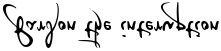

>### *Not sold in stores*
- Thanks T.M.L.B for original template & README.md

<a href="https://www.npmjs.com/package/react-webpack-codex" style="color: #fedcdc; padding: .566rem; background-color:rgba(236, 14, 188, 0.69); text-decoration: none; border-radius: 10px 201px 10px 122px ;">Click Here for a link to those...</a>

# Installed and eliminated package defaults from a jsx template. 
*Header/Footer/styles.css*

 
run the command npm run dev to build ( `npm run ` sets the NODE environment variable node executable with which npm is executed.